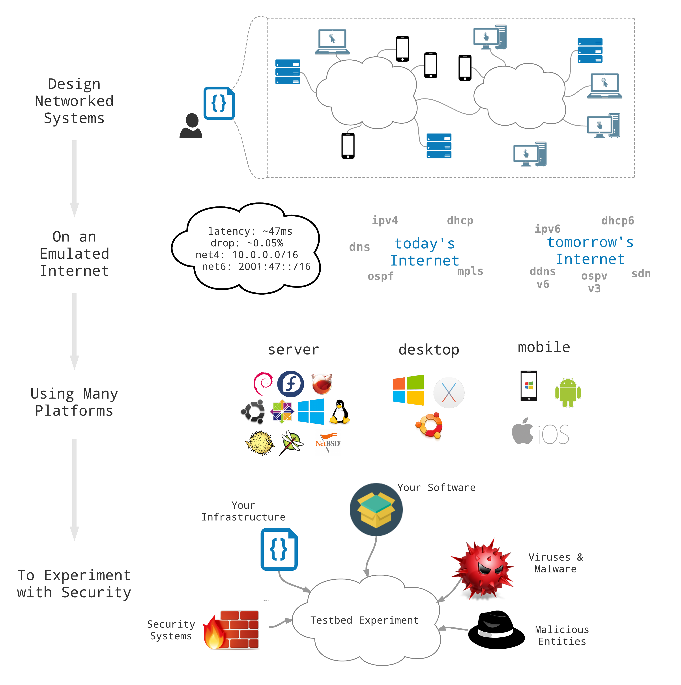
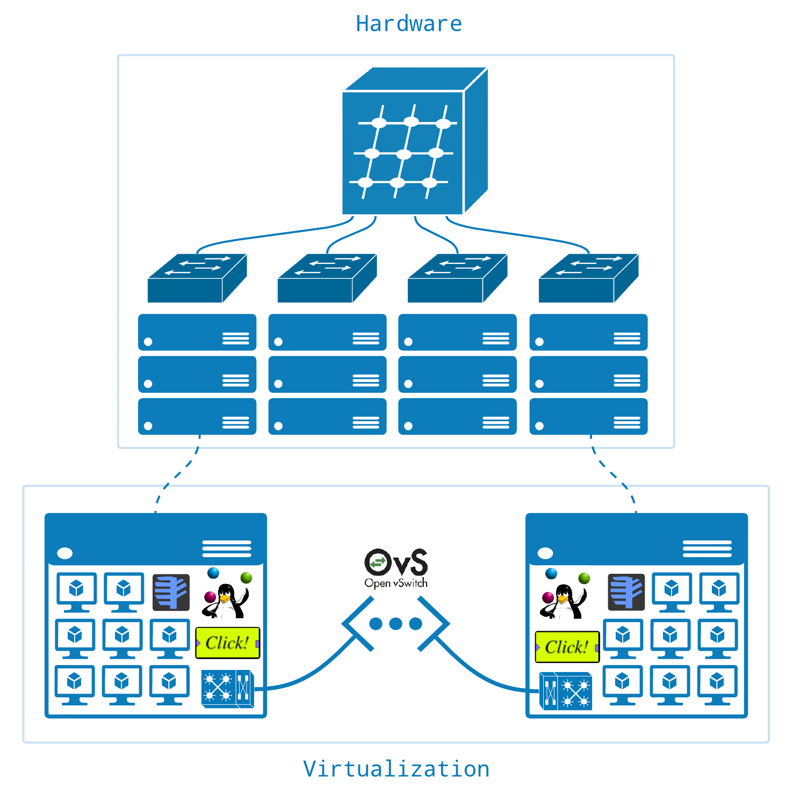
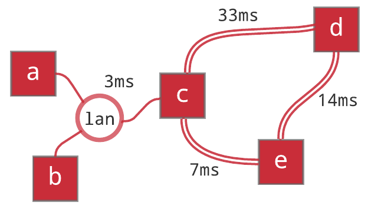
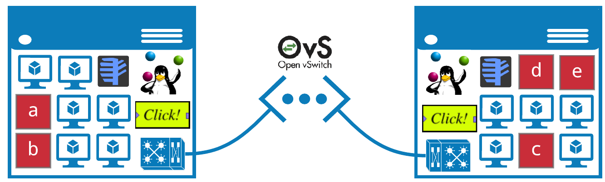
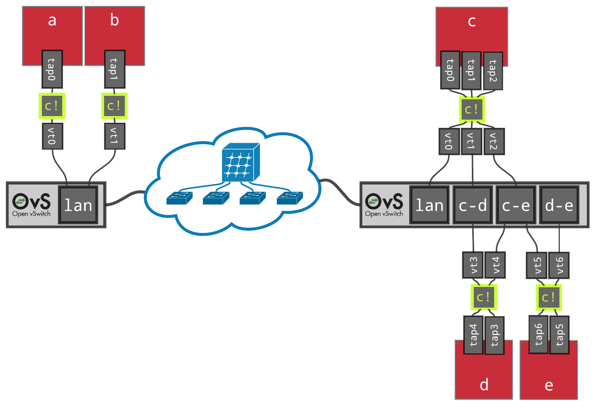
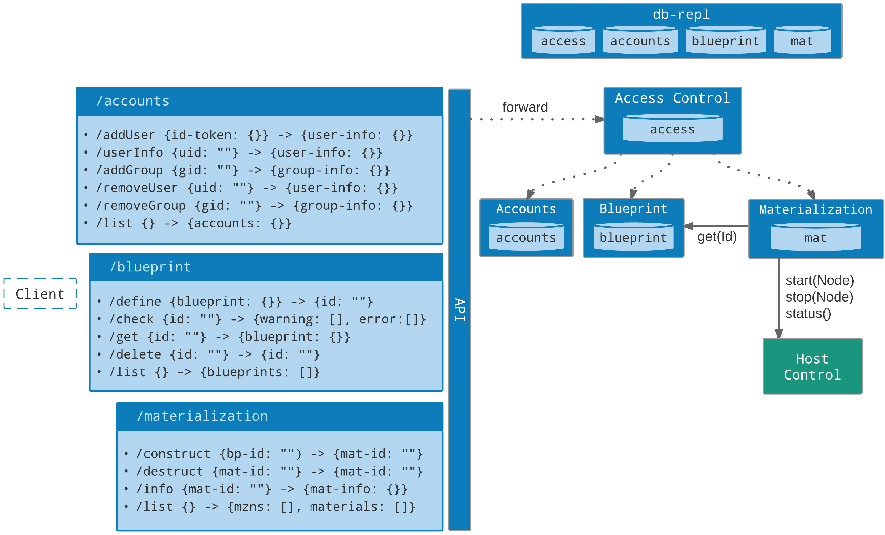
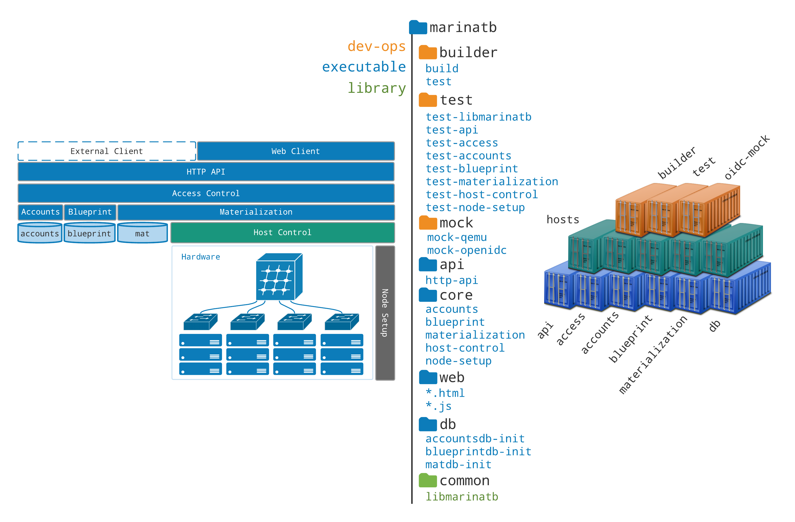
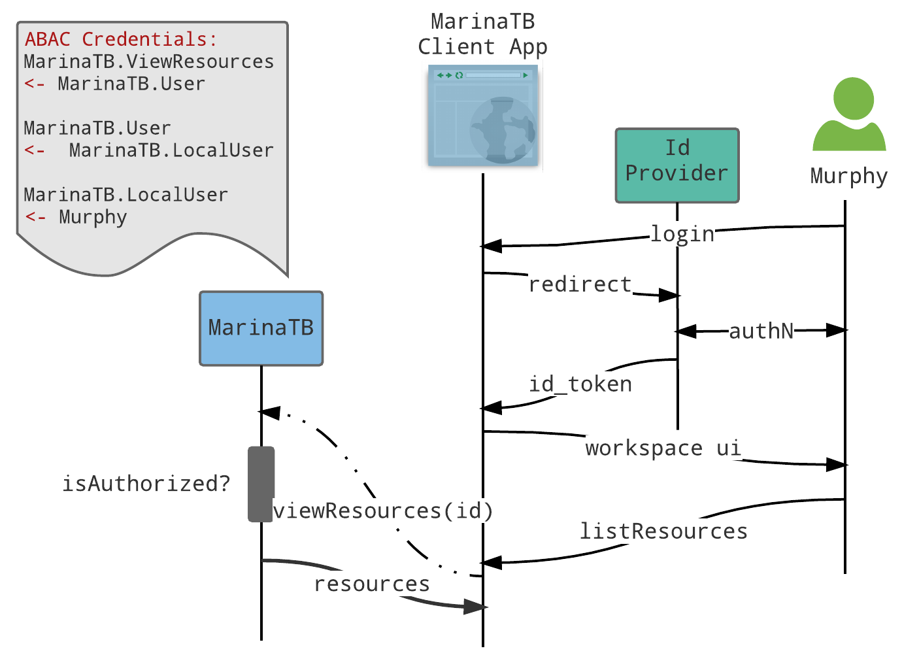
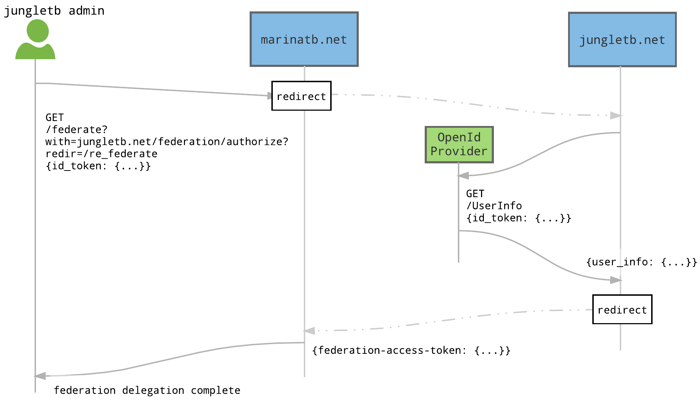
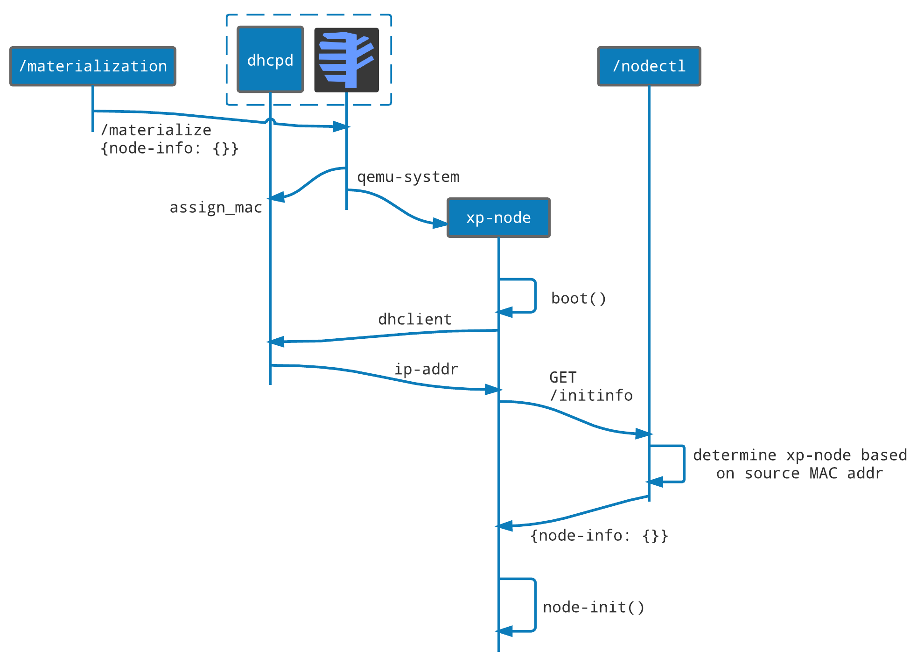

# Design & Implementation Docs

## Functionality

## Architecture

## Virtualization & Materialization

## Design
### High Level

## Build & Test

## User Access & Federation

### Web & API Access

### Federation

### Node Initialization & Access

